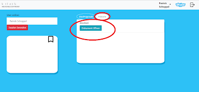

Conference-Assistant Tool

Benutzerleitfaden

Log In Ansicht

1.Der Log-In erfolgt über einen Klick auf den ,,Sign in with Google“-Button 

HINWEIS: 
Für die Verwendung des Tools muss der Benutzer ein Google-Konto besitzen. 

Die erforderlichen Zugangsdaten sind: 
die registrierte Google Email-Adresse
das vom Benutzer festgelegte Passwort
Bestätigt wird die Anmeldung mit einem Klick auf den „Weiter“-Button.

2. Nachdem die Zugangsdaten auf ihre Korrektheit hin geprüft wurden, erfolgt eine automatische Weiterleitung an die Session Start Ansicht. 

Session Start Ansicht
1. In der Session Start Ansicht werden alle Benutzer angezeigt, welche aktuell online und somit verfügbar für eine Konferenz sind.

Erkennbar sind diese an der Anzeige ihres individuellen Benutzernamens. 

HINWEIS: Der angezeigte Name ist der Benutzername des Google Kontos. 

2. Der Benutzer kann nun eine Konferenz, mit den aktuell verfügbaren Benutzern, über den Klick auf den ,,Session Start“-Button beginnen. Die Session wird anschließend automatisch bei allen anderen Teilnehmern gestartet. Analog wird die Konferenz bei allen Teilnehmern beendet, sobald einer der Teilnehmer die entsprechende Aktion durchführt.

3. Nach dem Start der Konferenz wird bei jedem der Teilnehmer die Konferenz Ansicht geöffnet.

Konferenz Ansicht

Die Konferenz Ansicht bildet den Kern der Anwendung. Diese bietet einige Interaktionsmöglichkeiten für den Benutzer, welche im Folgenden beschrieben werden.

Reiter Dokumentenvorschläge – Sunburst Diagramm

Das Sunburst Diagramm ist ein Mittel zur kategorisierten Darstellung von Daten. 

Dokumentenvorschläge anzeigen
In diesem Fall generiert das Conference-Assistant Tool Dokumentenvorschläge auf Basis der gesprochenen Inhalte zwischen den Konferenzpartnern. Diese Dokumentenvorschläge werden innerhalb des Sunburst Diagrammes angezeigt. Dieses erscheint, sobald der erste Dokumentenvorschlag generiert wurde. 

Es besteht aus zwei Ebenen, welche als Ringe dargestellt werden. In diesem Fall stellt der innere Ring die Kategorien dar, den äußeren Ring bilden die konkreten Dokumentenvorschläge. Somit kann der Bezug eines Dokumentenvorschlages bzw. mehrerer Dokumentenvorschläge zu einer Kategorie visualisiert werden. 

Die Kategorien werden auf Basis der Sprachanalyse generiert, wobei die gesprochenen Inhalte vom System automatisch kategorisiert werden und die entsprechenden Kategorien zur Anzeige an das Diagramm zurückgegeben werden. Die generierten Dokumentenvorschläge werden von dem System intern jeweils einer Kategorie zugeordnet. Die Anzeige der Dokumentenvorschläge innerhalb einer Kategorie erfolgt im äußeren Ring. Hierbei wird der Dokumentenvorschlag im Zusammenhang zu derjenigen Kategorie angezeigt, welcher er zugehörig ist. Zusätzlich wird die Dokumentenbezeichnung angezeigt. Der Benutzer kann somit erkennen, welcher Dokumentenvorschlag generiert wurde und welcher Gesprächs-Kategorie dieser zugeordnet ist. Möchte der Benutzer weitere Informationen zu einem bestimmten Dokument einsehen, genügt es den Mauszeiger darüber zu platzieren. Eine Mouseover-Funktion löst nun die Anzeige der jeweiligen Informationen zu dem Dokument an. 

Das Sunburst Diagramm hat eine maximale Anzeigekapazität von 15 Dokumentenvorschlägen. Ist diese Grenze erreicht, wird derjenige Dokumentenvorschlag automatisch durch einen neuen ersetzt, welcher die längste Anzeigedauer innerhalb des Diagrammes aufweist und somit der ,,Älteste“ ist. 

Farbgebung Sunburst Diagramm

Die Farbe der Dokumentenvorschläge richtet sich nach der Art des Dokuments welche vom System automatisch erkannt wird. Differenziert wird hierbei nach insgesamt drei Kategorien: 

Textdokument (dunkelblau)
Präsentation (rot)
Tabelle (dunkelgrün)

Fällt das Dokument in keine der drei beschriebenen Kategorien, wird dieses in der Default-Farbe grau angezeigt. 

Filterfunktion benutzen

Das Sunburst-Diagramm bietet dem Benutzer eine Filterfunktion. Klickt dieser auf eine der angezeigten Kategorien, verändert sich das Diagramm dynamisch und zeigt lediglich diejenigen Dokumentenvorschläge an, welche dieser Kategorie zugeordnet sind. Diese bilden den äußeren Ring. Der innere Ring besteht ausschließlich aus der gewählten Kategorie. 

Filterfunktion verlassen

Der Benutzer verlässt die Filterfunktion mit Hilfe eines Klicks innerhalb des Kreisausschnittes in der Mitte des Diagrammes. Das Sunburst Diagramm kehrt mit jedem Klick in diesen Bereich einen Schritt mehr in seine ursprüngliche Form zurück. 

Dokumentenvorschlag wählen

Sobald der Benutzer einen Dokumentenvorschlag per Klick auf ein entsprechendes Element des Sunburst Diagramms anwählt, erfolgt eine dynamische Anpassung. Das Diagramm zeigt ausschließlich den ausgewählten Dokumentenvorschlag an. 

Es öffnet sich anschließend automatisch ein Informationsfenster, welches die wichtigsten Metadaten zu dem Dokument anzeigt:

Ersteller
Bezeichnung

Der Benutzer hat hier zusätzlich die Möglichkeit zwischen zwei Aktionen zu wählen: 

Dokument öffnen:
Das Dokument wird mit Hilfe der jeweiligen Microsoft-Office Anwendung entsprechend des vorliegenden Formates geöffnet und ist für den Benutzer einsehbar. 

Dokument zu Favoriten hinzufügen:
Per Klick auf das Favoriten-Symbol hat der Benutzer die Möglichkeit das ausgewählte Dokument zu seiner Favoritenliste hinzuzufügen.

Favoriten

Favoriten hinzufügen
Der Benutzer hat die Möglichkeit Dokumentenvorschläge als Favoriten zu markieren und für einen schnellen Zugriff in einem separaten Bereich vorzuhalten. Dieser Bereich befindet sich innerhalb der Konferenz Ansicht unten links und ist durch ein Favoriten-Symbol gekennzeichnet. Wird ein Dokumentenvorschlag dem Favoritenbereich hinzugefügt, ist der Benutzer in der Lage das hier aufgelistete Dokument zu jeder Zeit aufzufinden und zu öffnen. Dies geschieht durch einen Klick auf den zu dem Dokumentenvorschlag zugehörigen ,,Dokument öffnen“-Button. Der Favoritenbereich hat keine Begrenzung bezüglich der Anzahl an Dokumenten. Somit der Benutzer in der Lage beliebig viele Dokumentenvorschläge als Favorit zu kennzeichnen. Wurde ein Dokument diesem Bereich hinzugefügt, bleibt dieses - ungeachtet der Anzeigedauer- so lange erhalten, bis der Benutzer dieses selbst aus dem Bereich entfernt.

Favoriten entfernen

Ein Dokument kann aus dem Favoritenbereich entfernt werden, indem der jeweilige rote ,,X“-Button angeklickt wird. Das Dokument wird anschließend aus dem Favoritenbereich entfernt.

Reiter: Historie

Mit dem Klick auf den Reiter ,,Historie“ wird der Bereich in dem sich zuvor das Sunburst-Diagramm befunden hat durch eine Auflistung von Dokumentenvorschlägen ersetzt. Der Historie-Bereich ist zu Beginn leer, zeigt im Laufe der Konferenz jedoch sämtliche Dokumente an, die während dessen vom Benutzer angeklickt wurden. Die Anzeige erfolgt in chronologischer Reihenfolge, wobei das zuletzt angeklickte Dokument stets an oberster Stelle angezeigt wird. 

Skype

Im oberen Bereich der Konferenzansicht befindet sich ein Skype-Symbol. Der Benutzer hat die Möglichkeit per Klick auf dieses Symbol das Öffnen des Videokonferenztools ,,Skype“ zu erwirken. Dieses wird in einem gesonderten Fenster geöffnet. Der Benutzer hat nun die Möglichkeit sich per Videokonferenz mit den Konferenzteilnehmern zu unterhalten und erhält parallel hierzu passende Dokumentenvorschläge innerhalb des ,,Conference-Assistant“ Tools. 

HINWEIS:

Das ,,Conference-Assistant“ Tool ist von der Anwendung ,,Skype“ unabhängig. D.h. sobald eine Session gestartet wird, zeichnet das Tool die gesprochene Sprache auf und analysiert diese. Auf diese Weise ist jedoch keine Konversation mit weiteren Teilnehmern möglich, sodass lediglich das vom Benutzer selbst Gesprochene analysiert und auf dieser Basis Dokumentenvorschläge generiert werden können. Es ist daher empfehlenswert vor dem Start der Session innerhalb des ,,Conference-Assistant“ Tools das Videokonferenztool ,,Skype“ zu öffnen und eine Videokonferenz mit den gewünschten Teilnehmern zu starten. 

Session End Ansicht

Die laufende Session kann per Klick auf den roten ,,Session beenden“- Button beendet werden. 

1. Nach dem Beenden der Session kehrt der Benutzer in die Session Start Ansicht zurück. 

Log Out Ansicht

Im oberen Bereich des Fensters befindet sich der Log-Out Button. Durch das Klicken auf diesen Button meldet sich der Benutzer automatisch aus seinem Google-Konto ab und verlässt den Conference-Assistant. 